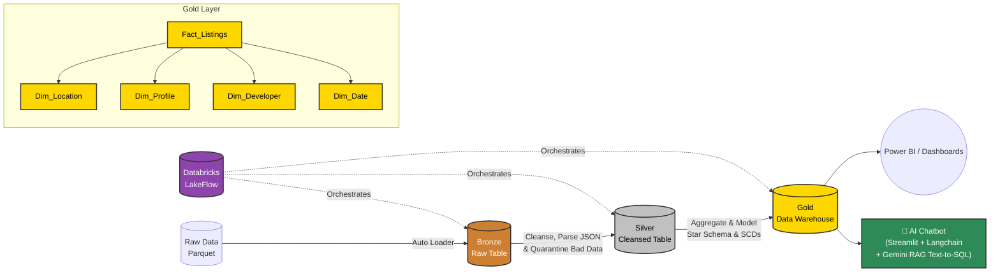

# 🏡 Real Estate Intelligence Lakehouse

   

An end-to-end, enterprise-grade Data Lakehouse built on Databricks, designed to process, model, and analyze real estate market data. This project leverages the Medallion Architecture, robust dimensional modeling (Star Schema), and GenAI capabilities via a Text-to-SQL RAG (Retrieval-Augmented Generation) system to empower business users with natural language data querying.

## 🏗️ Architecture Overview
The pipeline processes raw real estate listings, applies complex business logic and data quality checks, and serves a highly optimized Star Schema for BI tools and LLMs. The entire pipeline is orchestrated seamlessly using Databricks LakeFlow.

## ⚙️ Data Pipeline (Medallion Architecture)

### 🥉 Bronze Layer (Raw Ingestion)
- Ingests raw real estate files (flat Parquet/JSON/CSV) into Databricks Volumes.
- Acts as a historical archive with no schema enforcement, ensuring no data is dropped during ingestion.

### 🥈 Silver Layer (Cleansing & Conformed)
- **Incremental Processing**: Reads only new records from Bronze using custom high-water mark control tables.
- **Data Quality & Quarantine**: Implements a dead-letter queue pattern. Properties missing critical data (e.g., Price, Size, or City) are flagged and routed to a quarantine_table, while valid records are processed.
- **Complex Transformations**:
  - Standardizes text and resolves data entry anomalies (e.g., regex replacements for sizes and prices).
  - Normalizes string arrays and parses nested JSON amenities.
  - Imputes missing categorical and numerical data using PySpark Window functions (e.g., imputing Average Down Payment by Developer).
- **Upsert Logic**: Utilizes Delta MERGE to prevent duplicates and maintain a single source of truth per Property_ID.

### 🥇 Gold Layer (Dimensional Modeling)
Transforms the flattened Silver data into a highly performant Star Schema:
- **Fact_Real_Estate_Listings**: An Accumulating Snapshot Fact table tracking property metrics, payment flexibility scores, and milestone dates (Listing vs. Delivery).
- **Dim_Developer (SCD Type 2)**: Tracks historical changes in developer performance, including Market Reputation and Delivery Punctuality, ensuring accurate point-in-time analysis.
- **Dim_Location (SCD Type 1)**: Stores geospatial and neighborhood indexes (Schools, Malls, Transport).
- **Dim_Property_Profile (Junk Dimension)**: Consolidates low-cardinality flags (Has Pool, Has Elevator, Kitchen Type) into a single dimension using MD5 hash surrogate keys to optimize the Fact table size.
- **Dim_Date**: Static Date dimension for robust Time Intelligence in BI tools.

## 🤖 Text-to-SQL RAG (GenAI)
To democratize data access, this project integrates a Text-to-SQL RAG agent querying the Gold Layer.
- **Semantic Layer**: The Gold Star Schema provides clean, clearly named tables and relationships, acting as the perfect context for the LLM.
- **Natural Language Interaction**: Real estate brokers, investors, and analysts can ask complex questions in plain text, such as:
  *"Which developer has the highest payment flexibility score in New Cairo for properties ready to move in 2025?"*
- **Execution**: The RAG system retrieves the schema context, generates an optimized Databricks SQL query, executes it against the SQL Warehouse, and returns the insight seamlessly.

## 🔄 Orchestration with Databricks LakeFlow
The entire pipeline is automated and scheduled using Databricks LakeFlow.
- **Dependency Management**: Ensures Gold tasks only execute upon the successful completion of Bronze and Silver tasks.
- **Idempotency**: Custom control tables guarantee that rerunning a failed job will not process duplicate data.
- **Monitoring & Alerts**: LakeFlow provides native observability, triggering alerts if data fails data quality expectations or if a pipeline step drops.

## 🛠️ Tech Stack
- **Compute & Storage**: Databricks, Apache Spark, Delta Lake
- **Orchestration**: Databricks LakeFlow
- **Language**: Python (PySpark), Spark SQL
- **AI/ML**: Databricks GenAI / LangChain (Text-to-SQL RAG)
- **BI**: Power BI / Databricks SQL Dashboards
