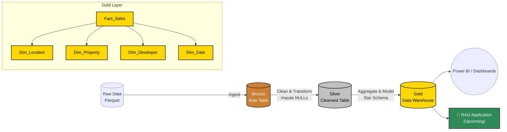

# Real Estate Databricks Analytics Platform


Welcome to the **Real Estate Databricks Analytics Platform**. This project demonstrates a production-grade, end-to-end data engineering pipeline built using the **Medallion Architecture** (Bronze, Silver, Gold). It cleans, transforms, and structures raw real estate data into a high-performance Data Warehouse (Star Schema) tailored for downstream BI and AI applications. We also plan to integrate **Retrieval-Augmented Generation (RAG)** for conversational insights.

---

## 🏗️ Architecture Overview

The pipeline strictly adheres to Databricks best practices, leveraging PySpark and Delta Lake tables to enforce ACID transactions and robust data constraints.



---

## 📂 Repository Structure

The project is modularized by pipeline layer.

```text
├── bronze/         # Layer 1: Ingestion from Raw Volumes to Delta
├── silver/         # Layer 2: Transformations, Standardization, Null Imputation
├── gold/           # Layer 3: Star Schema DWH (Dimensions, Facts, Constraints)
├── rag/            # AI: RAG logic for Real Estate Chatbots (WIP)
└── README.md       # Project Documentation
```

### 🟫 Bronze Layer (`/bronze`)
- **`01_Bronze_Ingestion.py`**: Reads raw parquet files iteratively to bypass initial schema mismatch errors, loading everything securely into `workspace.default.real_estate_bronze`.

### ⬜ Silver Layer (`/silver`)
- **`02_Silver_Cleansing.py`**: The core transformation layer.
  - Standardizes categorical variables (City, District).
  - Robust Regex parsing for JSON strings, corrupted Developer Names, dates, and currency.
  - Employs Windowed hierarchy median imputations (Developer-level -> District-level -> City-level fallback).
  - Feature Engineering (e.g., `Payment_Flexibility_Score`, `Is_Ready_To_Move`, routing random districts based on price bounds).

### 🟨 Gold Layer (`/gold`)
- **`03_Gold_DWH.py`**: Constructs the final Star Schema optimized for analytical reads.
  - **Dimensions**: `dim_date`, `dim_location`, `dim_developer`, `dim_property`.
  - **Facts**: `fact_sales` combining enriched KPIs (`Demand_Score`, `Developer_Strength_Score`).
- **`04_Gold_Constraints.py`**: Enforces strict Data Warehouse structural integrity. Officially registers Primary Key (PK) and Foreign Key (FK) constraints to link the ER diagram securely in the Databricks Unity Catalog.

### 🟩 RAG / LLM Integration (`/rag`)
- **Planned**: This directory will host scripts for generating vector embeddings from the Gold Layer data using Databricks Vector Search, and serving a Retrieval-Augmented Generation (RAG) model to answer complex real estate queries naturally.

---

## 🚀 Getting Started

### Prerequisites
1. **Databricks Workspace**: Ensure Unity Catalog is enabled to utilize table constraints.
2. **Compute Cluster**: A cluster running Databricks Runtime (DBR) 13.0+ for PySpark capabilities.
3. **Data**: Raw real estate parquet files ingested into your designated Databricks Volume (e.g., `raw_real_estate`).

### Execution Order
To process the data pipeline, run the notebooks in Databricks in the following sequence:

1. Run `/bronze/01_Bronze_Ingestion.py`
2. Run `/silver/02_Silver_Cleansing.py`
3. Run `/gold/03_Gold_DWH.py`
4. Run `/gold/04_Gold_Constraints.py`

*(Alternatively, orchestrate these via Databricks Workflows as a dependent job schedule).*

---

## 👨‍💻 Developed By
**Data Engineering Team**
*Adhering strictly to Databricks best practices, clean code principles, and scalable cloud architectures.*
